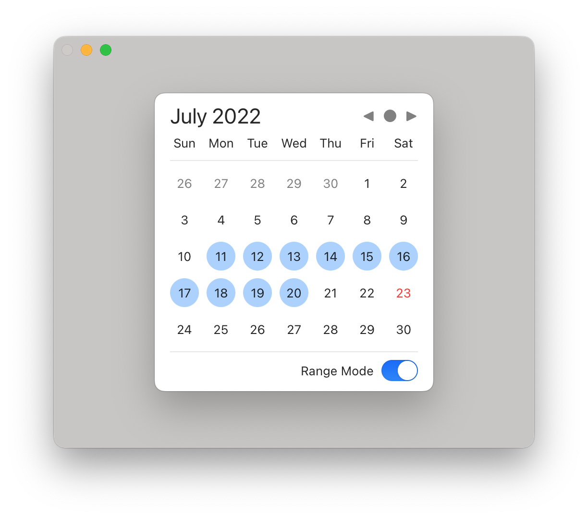

# WDatePicker

A datepicker supporting both single and range selection modes.

## Requirements

- macOS 13+
- Xcode 14+

## Installation

- In Xcode, go to `File -> Add Packages... -> Search or Enter Package URL`, enter `https://github.com/jerrywossion/WDatePicker`
